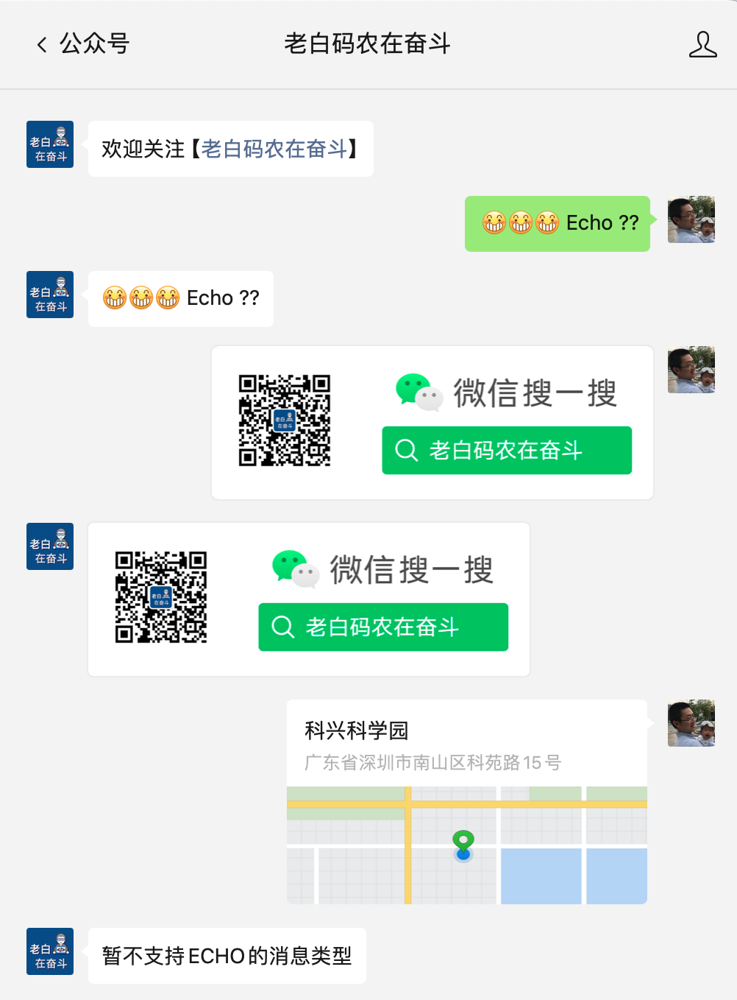
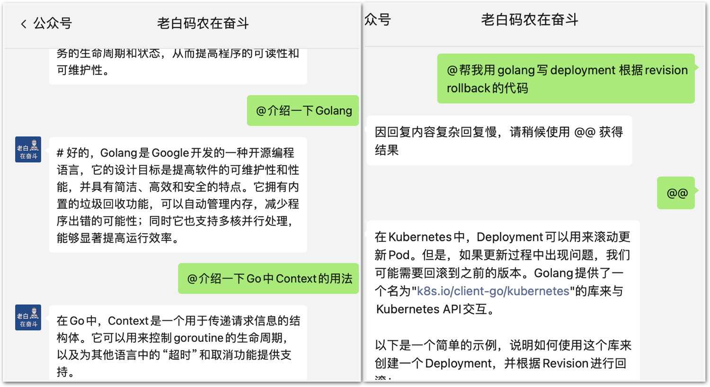
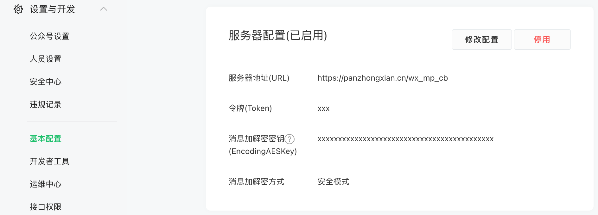

# 公众号消息回复服务

## 1. 项目介绍

本项目是一个基于 [Flask](https://flask.palletsprojects.com/en/1.1.x/) 的**微信公众号/订阅号的自动回复消息的简单服务框架**。使用者只需要实现两个简单的函数，即可快速搭建一个企业微信机器人回调功能的接口服务。

实现过程参考 [微信公众平台开发者文档-基础消息能力/接收普通消息](https://developers.weixin.qq.com/doc/offiaccount/Message_Management/Receiving_standard_messages.html) 和 [被动回复用户消息](https://developers.weixin.qq.com/doc/offiaccount/Message_Management/Passive_user_reply_message.html) 两个文档进行实现。

## 2. demo 效果

使用 demo/demo.py 中的示例，可以直接将实现一个 ECHO 功能的公众号服务。

这个 Echo 只为简单展示，而你可以基于该框架，实现更多的功能逻辑，甚至像我一样接入大模型。

## 3. 使用

与之前企业微信群机器人Server的部署方式不同，因为公众号的服务多属于个人且部署于外网，所以多会跟随个人的服务器部。所以这里没有提供 Docker 的方式进行部署，而是在服务器上运行脚本的方式进行部署。

### 3.1 配置公众号

如果要进行自动回复，需要先将公众号进行一定的配置，才可以让微信后台将消息转发到我们的服务器上。

1. 登录 mp.weixin.qq.com，点击左侧的【设置与开发】-【基本配置】
2. 点击右侧 【服务器配置】-【启用】
3. 记录下你的 AppID，后续会用到
4. 配置上你的服务器地址与路径，比如我这里的地址是 `https://panzhongxian.cn`，路径是 `/wx_mp_cb`
5. 配置上你的 Token 和 AES key，为了直接使用demo，我这里直接使用 ``xxx`` 和 43个 ``x`` 作为 Token 和 AES Key

此时因为还没有启动服务，所以直接保存会报错。所以我们先挂着这个页面，然后去服务器上拉起服务即可。

### 3.2 启动部署服务

1. 登录云主机，创建一个合适的目录，copy demo.py 到该目录下
2. 安装依赖包，`pip install wx-mp-svr`
3. **修改 demo.py**， 修改 AppID 为上边查询出的 AppID
4. 运行服务，`python demo.py`
5. 回到公众号配置页面，点击【提交】，如果没有报错，说明服务已经启动成功了

### 3.3 测试服务

通过上面的配置，我们已经实现了可以个性化自动回复消息的公众号服务，能够实现【demo 效果】中展示的功能。

- **关注公众号自动回复**：你可以取关自己的公众号，然后再进行关注，这时会收到一条自动回复的消息
- **Echo功能**：在公众号中发送一条消息，如果服务正常，会收到一条回复的 Echo 消息。文本、图片、语音消息。 目前 demo.py 中支持的 Echo 消息格式只有文本、图片、语音消息，其他消息格式可以自行实现处理逻辑

### 3.4 正式环境使用的注意事项

1. 不要直接使用 ``xxx`` 和 43 个 `x` 作为 Token 和 AES key，要自己生成一个随机的字符串。
2. 也可以代码里不填写 AppID、Token 以及 AES key，而是通过环境变量的方式进行传递：``WX_MP_APPID``、``WX_MP_TOKEN``、``WX_MP_AES_KEY``，这样可以避免
   代码泄露带来的风险。
3. 因为服务框架相对简单，没有做太多的安全和性能措施，建议配合自己的安全网关一起使用。比如我使用的127.0.0.1:5001作为服务的监听地址，
   然后通过nginx做反向代理，同时做一些安全控制。

## 4. 支持消息说明

当前已经封装了微信公众号官网支持的[7种消息类型](https://developers.weixin.qq.com/doc/offiaccount/Message_Management/Receiving_standard_messages.html)，具体的结构详见[req_msg.py](src%2Fwx_mp_svr%2Freq_msg.py)：

- 文本消息
- 图片消息
- 语音消息
- 视频消息
- 小视频消息
- 地理位置消息
- 链接消息

可以回复的消息类型，也与微信公众号官网支持的[6种消息类型](https://developers.weixin.qq.com/doc/offiaccount/Message_Management/Passive_user_reply_message.html)一致，具体结构见[rsp_msg.py](src%2Fwx_mp_svr%2Frsp_msg.py):

- 文本消息
- 图片消息
- 语音消息
- 视频消息
- 音乐消息
- 图文消息

## 其他说明

1. 因为这里的需要配置【服务器地址URL】，如果你只有中国国内的云主机，还需要一个备案的域名，不然会被云厂商拦截请求；如果是中国境外的云主机则无此限制。具体的原因有兴趣的可以参考我的文章:《[网站不备案是否能够访问？](https://panzhongxian.cn/cn/2022/10/build-personal-blog-step-by-step/#%E5%85%AD%E7%BD%91%E7%AB%99%E4%B8%8D%E5%A4%87%E6%A1%88%E6%98%AF%E5%90%A6%E8%83%BD%E5%A4%9F%E8%AE%BF%E9%97%AE)》
2. 如有任何问题欢迎提 Issue，也可以关注 知乎/公众号【老白码农在奋斗】留言咨询。